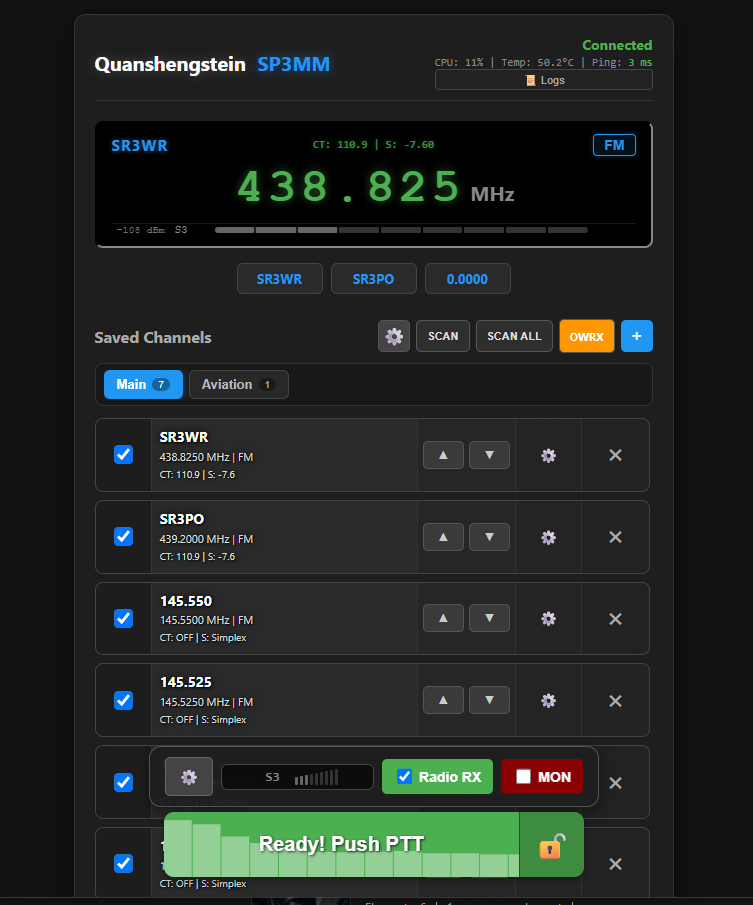
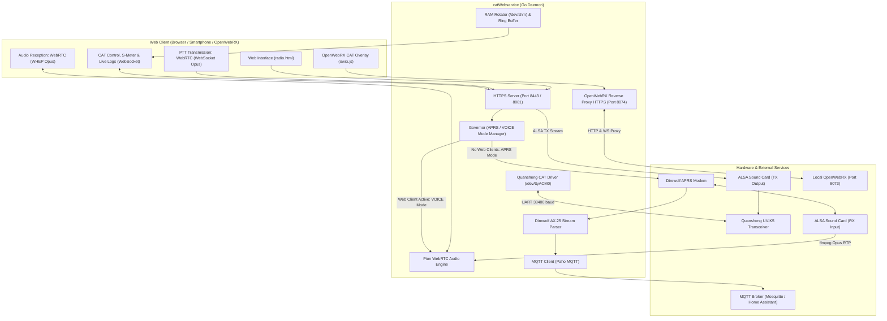

# Quanshengstein CAT Webservice

[](https://golang.org)
[](https://github.com)
[](https://github.com)
[](LICENSE)

A modern, standalone **Go (Golang)** service for complete remote control of **Quansheng UV-K1 / UV-K5 / UV-K6 / UV-5R Plus / UV-K5v3** transceivers. 

This software is specifically built to work with:
* 📻 **Firmware:** **[uv-k1-k5v3-firmware-CAT](https://github.com/sugarfree90/uv-k1-k5v3-firmware-CAT)** by sugarfree90 – adds native CAT commands, S-Meter telemetry (`S1`), fast memory scanning (`SCF`), and DTMF packet reporting (`RD...;`).
* 🔌 **Hardware Interface:** **[AIOC (All-In-One-Cable)](https://github.com/skuep/AIOC)** by Simon Kueppers (`skuep`) – a single compact USB-C adapter that plugs into the radio's Kenwood 2-pin connector and integrates both the **USB-UART CAT interface** (`/dev/ttyACM0`) and the **ALSA sound card** (`plughw:1,0`) in one device.

It features ultra-low-latency bi-directional **WebRTC (Pion)** audio streaming, a built-in **OpenWebRX** HTTPS reverse proxy with automatic CAT overlay injection, an automated **APRS IGate (Direwolf Governor)**, **DTMF tone detection**, comprehensive **MQTT telemetry**, and an in-memory **RAM logging system** specifically designed to prevent flash memory wear on Single Board Computers (SBCs like Orange Pi and Raspberry Pi).

---

## ⚠️ IMPORTANT SAFETY & LEGAL DISCLAIMER

> [!CAUTION]
> ### 1. Legal Warning: Radio Licensing & Authorizations
> * Transmitting (**TX / PTT**) on amateur radio frequencies strictly requires a **valid amateur radio license** (operator certificate) issued by your national telecommunications authority (e.g., FCC in the USA, UKE in Poland, Ofcom in the UK), along with an officially assigned callsign.
> * Transmitting without a license, operating out-of-band, or transmitting on emergency services, airband (aviation), military, or commercial frequencies is **illegal and subject to severe criminal penalties**.
> * The authors of this software assume no liability whatsoever for unauthorized, illegal, or improper use of this tool. The operator bears sole and full legal responsibility for all transmitted RF signals.

> [!WARNING]
> ### 2. Hardware Safety: Remote Power Cutoff / Watchdog Required
> * Although this service incorporates a software transmit timer (**TOT – Time-Out Timer**), unattended and remote installations carry inherent risks of:
>   * Unexpected computer (SBC) or Linux kernel lockups / freezes,
>   * USB / UART bus driver crashes that may leave the hardware CAT PTT line locked high in transmit mode,
>   * Network disconnects or power brownouts.
> * **It is strongly recommended to install an independent, remote power cutoff mechanism for the radio** (e.g., a smart Wi-Fi / Zigbee plug running Tasmota, Shelly, or Tuya to cut power to the radio's 12V DC power supply, or a hardware watchdog relay).
> * An unmonitored radio stuck in continuous transmit mode can rapidly overheat, destroy its RF power amplifier (PA), block the frequency, and cause a serious fire hazard!

> [!IMPORTANT]
> ### 3. Network Security: Do NOT Expose Directly to the Public Internet!
> * **NEVER expose this application's ports (`8081`, `8443`, `8074`) directly to the public Internet** (e.g., via DMZ or standard port forwarding on your router)!
> * This web interface does not feature built-in multi-user authentication. Anyone who accesses the web page gains full remote control over the radio's frequency, settings, and transmitter (PTT)!
> * **Recommended methods for secure remote access:**
>   1. **Encrypted VPN (Strongly Recommended):** Access your station remotely using secure VPN mesh networks such as **Tailscale**, **WireGuard**, **ZeroTier**, or **OpenVPN**.
>   2. **Reverse Proxy with Strong Authentication:** If public domain access is required, place the service behind an authenticated reverse proxy (e.g., Cloudflare Zero Trust / Access, Nginx, Caddy, Authelia, Authentik) with mandatory Two-Factor Authentication (2FA/MFA), IP allowlisting, and Fail2ban protection.

---

## 🌟 Key Features & Capabilities

### 1. Full Serial CAT Radio Control (USB-UART)
* **VFO Tuning:** Smooth frequency adjustments across 110–480 MHz with mouse scroll wheel, direct numeric keypad entry, or mobile touch controls.
* **Modulation Modes:** FM, Narrow FM (NFM), AM (Airband), USB, and LSB.
* **RF Output Power:** Multi-level power adjustments (Levels 1–7).
* **CTCSS & DCS Signaling:** Comprehensive support for analog CTCSS sub-audible tones and digital DCS codes.
* **Repeater Offsets (Shift):** Selectable offset direction (Simplex, `+`, `-`) and customizable offset step in MHz (e.g., `0.600 MHz` for 2m, `7.600 MHz` for 70cm).
* **Hardware S-Meter & Squelch Gate:** Real-time signal strength readout in **dBm**, translated to the standard **S0–S9 (+10..+60 dB)** scale, alongside real-time hardware squelch gate detection.
* **Squelch Override (Monitor):** Instant monitor toggle button (`MON`) to open squelch on demand.

### 2. Bi-Directional WebRTC Audio with Ultra-Low Latency (< 100 ms)
* **Reception (RX):** Captures audio from the radio's ALSA interface via `ffmpeg`, encodes it into Opus, and streams via WHEP directly to modern web browsers with minimal latency.
* **Digital RX Pre-Amplifier:** Browser-side Web Audio API gain adjustment from **0.2x to 10.0x** with persistent storage in browser cookies.
* **Transmission (TX / PTT):** Secure microphone capture in the browser (over HTTPS), streaming Opus packets over WebSocket, hardware ALSA decoding to the radio mic input, and automatic CAT PTT engagement protected by a configurable Time-Out Timer (TOT).
* **PTT Audio Sync (Buffer Tail & Anti-Clipping Protection):**
  * **The Problem:** In remote web operation, releasing the PTT button the moment you finish speaking often drops the transmitter carrier too soon, cutting off your final words or callsign before the buffered audio can complete its path through the browser worklet, WebSocket queue, ffmpeg pipe, and ALSA sound card buffer.
  * **The Solution:** When PTT Audio Sync is active, releasing PTT flushes the remaining microphone audio buffer to the server and maintains the radio in transmit mode (`TX`) until all buffered audio has finished playing out through ALSA.
  * **Live Progress Bar on PTT:** An animated progress bar and remaining countdown timer display directly on the PTT button (e.g. `PTT SYNC (0.4s)`). The button returns to its ready green state (`Ready! Push PTT`) only after the transmission has completely cleared and the radio has returned to RX.
  * **Non-Blocking Instant Resumption:** Pressing PTT again while the buffer is draining immediately cancels the drain timer and seamlessly resumes active transmitting without dropping the carrier or clicking the transceiver's relay.
  * **Persistent Setting:** Toggleable via the checkbox directly to the right of *Enable Speech Compressor* under the settings gear icon (⚙️) in the OpenWebRX overlay (`owrx.js`), saved in `radio_db.json` and synchronized across all connected browser clients.

### 3. OpenWebRX HTTPS Reverse Proxy with Automatic CAT Overlay
* **Built-in HTTPS Proxy (Port `8074`):** Seamlessly proxies OpenWebRX HTTP and WebSocket SDR waterfall streams under the same trusted TLS certificate.
* **Automated Overlay Injection (`owrx.js`):** Dynamically injects the CAT transceiver control bar into OpenWebRX HTML responses on the fly (`proxy.ModifyResponse`). **Zero modifications required to OpenWebRX configuration or templates!**
* **Instant UI Access:** Dedicated orange `OWRX` button positioned directly next to `SCAN ALL` in the web panel.

### 4. Background Services Governor (APRS Direwolf & DTMF Dual-Watch)
* **Autonomous Governor:**
  * When no web clients are connected (`clientCount == 0`), the service automatically tunes the radio to the national APRS frequency (`144.800 MHz` in Europe, `144.390 MHz` in the USA) and spawns **Direwolf** as an APRS IGate.
  * When a web client connects, Direwolf is gracefully suspended, the ALSA sound card is handed over to the WebRTC voice engine, and the radio restores your active VFO frequency.
* **Hardware Background Dual-Watch:**
  * When both APRS and DTMF services are enabled, the background scanner rapidly hops between APRS and DTMF frequencies (70 ms cycle).
  * Carrier detection pauses scanning, enabling Direwolf to decode AX.25 packets or the radio MCU to decode DTMF tones.
* **DTMF Code Reception:** Processes `RD<code>,<dBm>;` notifications directly from modified Quansheng firmware, flashing the detected code in the web VFO and publishing it to MQTT.

### 5. Comprehensive MQTT Integration (Home Assistant & Telemetry)
* **APRS-to-JSON Decoder:** Every AX.25 packet received by Direwolf is parsed into structured JSON and published to dedicated MQTT topics:
  * `{prefix}/packets` – Raw dump of all decoded packets,
  * `{prefix}/stations/{CALLSIGN}` – Packets categorized by transmitting station,
  * `{prefix}/weather/{CALLSIGN}` – Decoded weather station (WX) telemetry (temperature, barometric pressure, wind, rainfall),
  * `{prefix}/telemetry/{CALLSIGN}` – Station telemetry channels (A1–A5, D1–D8),
  * `{prefix}/positions/{CALLSIGN}` – GPS coordinates formatted for Home Assistant *Device Tracker*.
* **DTMF Tone Reports:** Instant MQTT publication of received DTMF codes with signal level (dBm), frequency, and UTC timestamp.
* **Real-time Radio Status & Squelch Reporting:** The `radio/status` topic broadcasts frequency, modulation, power, repeater offset, PTT state, and squelch gate status (`squelch_open` / `squelch`). **Squelch state reporting is gated exclusively to active browser sessions**, preventing MQTT flooding during background APRS/DTMF scanning.

### 6. Tabbed Memory Scanner with Live S-Meter
* **Channel Tabs (Scanlists):** Group channels into organized categories (e.g., *2m VHF, 70cm UHF, Airband, PMR, Marine*).
* **Dual Scan Modes (`SCAN` & `SCAN ALL`):**
  * `SCAN` – Scans flagged channels within the active tab.
  * `SCAN ALL` – Scans across all tabs with live multi-channel signal bars and dBm readouts.
* **Instant Click-to-Tune:** Clicking any channel tile while scanning immediately stops the scanner, un-mutes WebRTC voice audio, and selects the channel.
* **Configurable Carrier Loss Delay:** Smooth slider adjustment (0.0 to 10.0 s) controlling pause duration before scan resumption, stored persistently in cookies and `radio_db.json`.

### 7. Flash Wear Protection & RAM Logging (`/dev/shm`)
* **MicroSD Card Protection for SBCs (Orange Pi / Raspberry Pi):**
  * Log files are buffered in RAM (`tmpfs` at `/dev/shm/catwebservice.log`), completely eliminating continuous flash writes.
  * Built-in file rotator maintains a strict size limit (default: 2 MB) and retains one backup copy (`.1`).
* **Live In-Memory Web Console:**
  * The `📜 Logs` button in the top status bar opens a live modal streaming recent logs (500 lines) directly from memory via WebSocket channels.
  * Mirrored standard output (`stdout`) for convenient monitoring using `journalctl -u catwebservice -f`.
  * Plain text endpoint available at `https://<IP>:8443/logs`.

---

## 🏗️ System Architecture



---

## 📂 Repository File Structure

```
catWebservice/
├── catWebservice.go        # Main Go backend (CAT, WebRTC, HTTP/S, Governor)
├── mqtt_manager.go         # MQTT client manager, telemetry & squelch reporting
├── aprs_parser.go          # Direwolf APRS console stream parser -> JSON
├── logger.go               # In-memory RAM rotator (/dev/shm) & log ring buffer
├── config.json             # Clean, pre-configured settings template (in English)
├── direwolf.conf           # APRS Direwolf modem configuration template
├── radio_db.json           # Default channel database with tabs (2m, 70cm, Airband, PMR)
├── buildAll.ps1            # Multi-architecture cross-compilation script (PowerShell)
├── go.mod / go.sum         # Go module definition and dependencies
├── build/                  # Pre-compiled, ready-to-run binaries:
│   ├── catWebservice_linux_arm64       # 64-bit Linux (Orange Pi Zero 3, RPi 3/4/5 64-bit)
│   ├── catWebservice_linux_armv7       # 32-bit Linux (Orange Pi One, RPi 2/3 32-bit)
│   ├── catWebservice_linux_armv6       # Raspberry Pi Zero / 1
│   ├── catWebservice_linux_armv5       # Legacy ARMv5 devices
│   ├── catWebservice_linux_amd64       # Standard Linux x86_64 servers / PCs
│   ├── catWebservice_linux_386         # 32-bit x86 Linux
│   ├── catWebservice_windows_amd64.exe # 64-bit Windows PC
│   ├── catWebservice_windows_386.exe   # 32-bit Windows PC
│   └── catWebservice_windows_arm64.exe # Windows on ARM64
└── pubhtml/
    ├── radio.html          # Responsive web interface (desktop, tablet, mobile)
    └── owrx.js             # OpenWebRX CAT overlay widget & WebRTC PTT audio engine
```

---

## 🚀 Quick Start Guide

For a comprehensive, step-by-step setup guide on a fresh Linux installation, see:
👉 **[INSTALL.md](INSTALL.md)**

### Option A: Using Pre-Compiled Binaries from `./build/` (No Go installation needed)

1. Identify your system architecture:
   ```bash
   uname -m
   ```
2. Copy the matching binary to the root directory:
   ```bash
   # For 64-bit ARM (Orange Pi Zero 3, Raspberry Pi 4/5 64-bit):
   cp build/catWebservice_linux_arm64 ./catWebservice
   chmod +x ./catWebservice

   # Or for 32-bit ARM (Orange Pi One, Raspberry Pi 2/3 32-bit):
   # cp build/catWebservice_linux_armv7 ./catWebservice
   # chmod +x ./catWebservice
   ```
3. Edit `config.json` with your callsign, serial port, and sound card IDs:
   ```bash
   nano config.json
   ```
4. Start the service:
   ```bash
   ./catWebservice
   ```

---

### Option B: Building from Source Code (Go 1.22+)

```bash
# Fetch dependencies and compile
go mod tidy
go build -o catWebservice

# Run
./catWebservice
```

### Accessing the Web Interface

* **Main HTTPS Interface (Recommended):** `https://<SERVER-IP>:8443/radio.html` *(HTTPS is mandatory for browser microphone access)*
* **Main HTTP Interface:** `http://<SERVER-IP>:8081/radio.html`
* **OpenWebRX with CAT Overlay:** `https://<SERVER-IP>:8074/`
* **Raw RAM Logs:** `https://<SERVER-IP>:8443/logs`

---

## ⚙️ Configuration Parameters (`config.json`)

All settings are described with inline comments in `config.json`. Below is a reference summary:

| Section | Key | Description | Default |
| :--- | :--- | :--- | :--- |
| **Station Identity** | `callsign` | Callsign displayed in UI header and MQTT status | `"N0CALL"` |
| **Serial / CAT** | `serial_port` | Path to serial device | `"/dev/ttyACM0"` |
| | `baud_rate` | CAT baud rate (firmware default) | `38400` |
| **Network & Web** | `ws_port` | Standard HTTP port | `8081` |
| | `https_port` | Secure HTTPS port (required for WebRTC / mic) | `8443` |
| **OpenWebRX Proxy** | `owrx_proxy_enabled`| Enable built-in HTTPS proxy for OpenWebRX | `true` |
| | `owrx_backend_url`  | Local OpenWebRX instance URL | `"http://127.0.0.1:8073"` |
| | `owrx_proxy_port`   | Dedicated HTTPS port for OpenWebRX with overlay | `8074` |
| **RAM Logging** | `log_mode` | Logging mode: `"shm"` (RAM), `"stdout"`, or `"off"` | `"shm"` |
| | `log_max_size_mb`   | Max RAM log size before rotation | `2` MB |
| **ALSA Audio** | `audio_rx_device`   | ALSA input device (Radio SPK -> Server) | `"1,0"` |
| | `audio_tx_device`   | ALSA output device (Server -> Radio MIC) | `"1,0"` |
| **Background Services**| `use_direwolf` | Run Direwolf APRS IGate when no web clients active | `true` |
| | `aprs_freq`         | APRS frequency in Hz | `144800000` |
| | `dtmf_freq`         | DTMF monitoring frequency in Hz | `433000000` |
| **MQTT** | `mqtt_broker`       | MQTT broker connection URL | `"tcp://127.0.0.1:1883"` |
| | `mqtt_aprs_enabled` | Publish decoded APRS packets as JSON | `true` |
| | `mqtt_dtmf_enabled` | Publish decoded DTMF codes as JSON | `true` |
| | `mqtt_status_enabled`| Publish live radio parameters & squelch status | `true` |

---

## 📡 MQTT Topics & Payloads

When `mqtt_status_enabled` is active, the service publishes real-time transceiver status to `radio/status`:

```json
{
  "timestamp": "2026-09-19T14:30:00Z",
  "callsign": "N0CALL",
  "ptt": false,
  "freq": 145550000,
  "freq_mhz": 145.55,
  "mod": "FM",
  "pwr": 6,
  "ctcss": 0,
  "dcs": 0,
  "shift_dir": 0,
  "shift_val": 0,
  "tx_freq": 145550000,
  "tx_freq_mhz": 145.55,
  "monitor": 0,
  "squelch_open": true,
  "squelch": true
}
```

> [!NOTE]
> The `squelch_open` and `squelch` fields indicate whether the squelch gate is currently open due to received carrier or manual monitor toggle. To prevent excessive MQTT traffic, squelch status updates are **gated strictly to active web sessions** (voice monitoring mode) and remain silent during background scanning.

---

## 🛠️ Cross-Compilation Script (`buildAll.ps1`)

To rebuild all binary targets for all supported operating systems and architectures from Windows:

```powershell
powershell -ExecutionPolicy Bypass -File .\buildAll.ps1
```

All compiled binaries are placed automatically into the `build/` directory.

---

## 📄 License

This project is licensed under the MIT License. You are free to modify, study, and distribute this software for personal, amateur, and educational use.

Vy 73!
