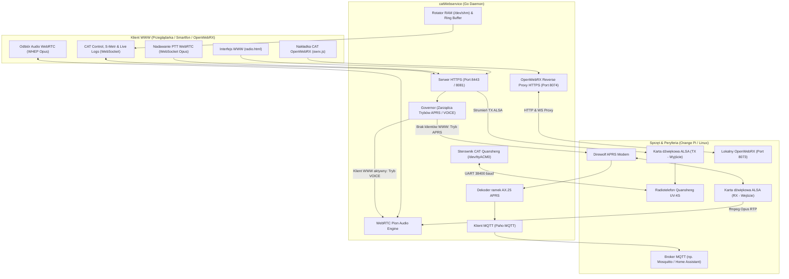

# Quanshengstein CAT Webservice

[](https://golang.org)
[](https://github.com)
[](https://github.com)
[](LICENSE)
Nowoczesny, samodzielny webservice w języku **Go (Golang)** do pełnego, zdalnego sterowania radiotelefonami **Quansheng UV-K1 / UV-K5 / UV-K6 / UV-5R Plus / UV-K5v3**.

Oprogramowanie jest dedykowane do współpracy z:
* 📻 **Oprogramowaniem radia (firmware):** **[uv-k1-k5v3-firmware-CAT](https://github.com/sugarfree90/uv-k1-k5v3-firmware-CAT)** autorstwa sugarfree90 – wprowadza natywną obsługę komend CAT, telemetrię S-Metra (`S1`), szybkie sprzętowe skanowanie pamięci kanałów (`SCF`) oraz raportowanie odebranych tonów DTMF (`RD...;`).
* 🔌 **Interfejsem sprzętowym:** **[AIOC (All-In-One-Cable)](https://github.com/skuep/AIOC)** autorstwa Simona Kueppersa (`skuep`) – miniaturowy adapter USB-C wpinany w złącze 2-pin Kenwood radia, integrujący w jednym urządzeniu **port szeregowy USB-UART CAT** (`/dev/ttyACM0`) oraz **kartę dźwiękową ALSA** (`plughw:1,0`).

Aplikacja zapewnia dwukierunkowe strumieniowanie dźwięku przez **WebRTC (Pion)** o ultraniskim opóźnieniu, wbudowane reverse proxy HTTPS do **OpenWebRX** z automatyczną nakładką CAT, bramkę **APRS (Direwolf Governor)**, detekcję **DTMF**, telemetrią **MQTT** oraz system logowania w pamięci RAM chroniący nośniki flash komputerów jednopłytkowych (SBC).
---

## ⚠️ WAŻNE OSTRZEŻENIA: BEZPIECZEŃSTWO I PRAWO (DISCLAIMER)

> [!CAUTION]
> ### 1. Ostrzeżenie prawne: Licencja i uprawnienia radiowe
> * Korzystanie z funkcji nadawania (**TX / PTT**) na częstotliwościach pasm amatorskich wymaga posiadania **ważnego pozwolenia radiowego** (świadectwa operatora urządzeń radiowych w służbie radiokomunikacyjnej amatorskiej) oraz przydzielonego znaku wywoławczego.
> * Nadawanie bez uprawnień, praca na częstotliwościach służb ratunkowych, pasmach komercyjnych, lotniczych (Airband) czy wojskowych jest **surowo zabroniona i podlega odpowiedzialności karnej**.
> * Autorzy oprogramowania nie ponoszą żadnej odpowiedzialności za nieuprawnione lub niezgodne z prawem telekomunikacyjnym wykorzystanie tego narzędzia. Użytkownik ponosi wyłączną i pełną odpowiedzialność za emitowane sygnały.

> [!WARNING]
> ### 2. Zdalne wyłączanie zasilania radia (Hardware Power Cutoff / Watchdog)
> * Choć oprogramowanie posiada wbudowane zabezpieczenie programowe wyłączające nadawanie (**TOT – Time-Out Timer**), w instalacji zdalnej może dojść do:
>   * nieoczekiwanego zawieszenia komputera (SBC, jądra Linuksa),
>   * błędu magistrali USB/UART blokującego linie CAT/PTT w stanie wysokim,
>   * problemów z zasilaniem lub utraty łączności sieciowej.
> * **Bezwzględnie zaleca się zastosowanie niezależnego, zdalnego wyłącznika zasilania radia** (np. inteligentne gniazdko Wi-Fi/Zigbee odcinające zasilacz radia, przekaźnik sterowany zewnętrznym mikrokontrolerem ESP32/Arduino, bądź sprzętowy watchdog sprzężony z linią zasilania DC).
> * Ciągłe, niezamierzone zablokowanie radia w trybie nadawania grozi przegrzaniem, trwałym spaleniem stopnia końcowego mocy (PA), a w skrajnym przypadku pożarem i zablokowaniem pasma!

> [!IMPORTANT]
> ### 3. Bezpieczeństwo sieciowe: Zakaz bezpośredniej publikacji w Internecie!
> * **NIGDY nie wystawiaj portów tej aplikacji (`8081`, `8443`, `8074`) bezpośrednio do publicznego Internetu** (np. poprzez przekierowanie portów DMZ na routerze)!
> * Interfejs webowy nie posiada wbudowanego wieloskładnikowego systemu uwierzytelniania. Każda niepowołana osoba, która trafi na otwarty port, zyskuje możliwość przestrajania radia oraz załączania nadajnika!
> * **Zalecane metody bezpiecznego dostępu zdalnego:**
>   1. **Prywatna sieć VPN (Metoda rekomendowana):** Dostęp spoza sieci domowej realizuj wyłącznie poprzez bezpieczny tunel VPN, np. **Tailscale**, **WireGuard**, **ZeroTier** lub **OpenVPN**.
>   2. **Reverse Proxy z silną autoryzacją:** Jeśli konieczne jest wystawienie pod domeną, zabezpiecz ruch zewnętrznym serwerem proxy (np. Nginx, Caddy, Cloudflare Zero Trust / Access, Authelia, Authentik) z wymuszoną autoryzacją dwuskładnikową (2FA/MFA), filtrowaniem IP i firewallem Fail2ban.

---

## 🌟 Główne Funkcje i Możliwości

### 1. Sterowanie radiem przez CAT (USB-Serial)
* **VFO:** Płynna zmiana częstotliwości (110–480 MHz) z obsługą rolki myszy, klawiatury numerycznej i gestów dotykowych na smartfonie.
* **Modulacje:** FM, NFM, AM, USB, LSB.
* **Moc nadawania:** Regulacja w pełnym zakresie (poziomy 1–7).
* **Tony CTCSS & DCS:** Pełna obsługa tonów analogowych CTCSS oraz kodów cyfrowych DCS.
* **Obsługa przemienników (Shift):** Wybór kierunku przesunięcia (Simplex, `+`, `-`) oraz wartości offsetu w MHz (np. `0.600` dla VHF, `7.600` dla UHF).
* **Wskaźnik sygnału (S-Metr):** Cyfrowy odczyt siły sygnału w **dBm**, przeliczenie na skalę **S0–S9 (+10..+60 dB)** oraz sprzętowy stan otwarcia blokady szumów (**Squelch**).
* **Wymuszenie otwarcia squelcha (Monitor):** Szybkie otwarcie bramki szumów przyciskiem `MON`.

### 2. Dwukierunkowe Audio WebRTC o ultraniskim opóźnieniu (< 100 ms)
* **Odbiór (RX):** Odczyt dźwięku z karty ALSA radia przez `ffmpeg`, kodowanie Opus i strumieniowanie WHEP do przeglądarki.
* **Wzmocnienie RX (Digital Pre-amp):** Cyfrowy suwak wzmocnienia Web Audio API w przeglądarce od **0.2x do 10.0x** z pamięcią w ciasteczkach (`cookies`).
* **Nadawanie (TX / PTT):** Przechwytywanie mikrofonu w przeglądarce (wymaga bezpiecznego kontekstu HTTPS), przesyłanie strumienia Opus przez WebSocket, dekodowanie do karty dźwiękowej radia i automatyczne załączanie PTT przez CAT z zabezpieczeniem sprzętowym TOT (*Time-Out Timer*).

### 3. OpenWebRX HTTPS Reverse Proxy z automatyczną nakładką CAT
* **Wbudowane proxy HTTPS (port `8074`):** Umożliwia wygodny dostęp do lokalnej instancji OpenWebRX przez ten sam bezpieczny certyfikat SSL.
* **Automatyczne wstrzykiwanie nakładki (`owrx.js`):** Webservice automatycznie wstrzykuje panel sterowania radiem do kodu HTML OpenWebRX w locie (`proxy.ModifyResponse`). **Nie wymaga modyfikacji plików ani konfiguracji OpenWebRX!**
* **Dostęp w interfejsie:** Pomarańczowy przycisk `OWRX` umieszczony obok przycisku `SCAN ALL` w panelu WWW.

### 4. Inteligentny zarządca tła (APRS Direwolf & DTMF Dual-Watch)
* **Automatyczny Governor:**
  * Gdy żaden użytkownik nie korzysta z przeglądarki WWW (`clientCount == 0`), radio przełącza się na częstotliwość APRS (`144.800 MHz`) i uruchamia proces **Direwolf** jako bramkę APRS IGate.
  * Po otwarciu strony WWW przez klienta, Direwolf jest natychmiast bezpiecznie zwalniany, karta ALSA przechodzi w tryb Voice (WebRTC), a radio dostraja się do częstotliwości VFO.
* **Sprzętowy Dual-Watch w tle:**
  * Gdy aktywne są usługi APRS i DTMF, radio w tle wykonuje ultraszybki skok sprzętowy (70 ms) między częstotliwością APRS a kanałem DTMF.
  * Po wykryciu nośnej skaner zatrzymuje się, umożliwiając odebranie ramki APRS lub zdekodowanie kodu DTMF przez procesor radia.
* **Odbiór kodów DTMF:** Odbiór zgłoszeń `RD<kod>,<dBm>;` z firmware Quansheng, podświetlenie odebranego kodu w VFO na żółto i publikacja do MQTT.

### 5. Integracja z brokerem MQTT (Home Assistant & Telemetria)
* **Dekoder APRS -> JSON:** Każda odebrana ramka AX.25 Direwolfa jest dekodowana do obiektów JSON i publikowana w dedykowanych tematach:
  * `{prefix}/packets` – pełny zrzut wszystkich ramek,
  * `{prefix}/stations/{CALLSIGN}` – ramki filtrowane według znaku stacji,
  * `{prefix}/weather/{CALLSIGN}` – raporty pogodowe WX (temperatura, ciśnienie, wiatr, opady),
  * `{prefix}/telemetry/{CALLSIGN}` – telemetria stacji,
  * `{prefix}/positions/{CALLSIGN}` – współrzędne GPS zgodne z Home Assistant *Device Tracker*.
* **Raporty DTMF:** Publikacja odebranych tonów DTMF z sygnaturą czasową, poziomem sygnału w dBm i częstotliwością.
* **Status Radia & Blokada Szumów (Squelch):** Temat `radio/status` publikuje częstotliwość, modulację, moc, offset, PTT oraz stan blokady szumów (`squelch_open` / `squelch`). **Status squelcha publikowany jest wyłącznie w trybie przeglądarki**, co całkowicie eliminuje spamowanie brokera podczas pracy w tle.

### 6. Zaawansowany Skaner z Zakładkami (Tabs) i S-Metrem
* **Zakładki (Scanlisty):** Podział kanałów na kategorie (np. *2m, 70cm, Lotnictwo, PMR, Służby*).
* **SCAN & SCAN ALL:**
  * `SCAN` – skanuje zaznaczone kanały w aktywnej zakładce.
  * `SCAN ALL` – równoległy skan wszystkich zaznaczonych kanałów ze wszystkich zakładek z podglądem poziomu sygnału na żywo.
* **Kliknij-aby-dostroić:** Kliknięcie w dowolny kafelek kanału podczas skanowania natychmiast zatrzymuje skaner, włącza foniczny odsłuch WebRTC i przełącza widok na właściwą zakładkę.
* **Konfigurowalny czas wznowienia:** Suwak opóźnienia po zaniku nośnej (od 0.0 do 10.0 s) z trwałym zapisem w cookies i bazie `radio_db.json`.

### 7. Ochrona nośników Flash i Logowanie w pamięci RAM (`/dev/shm`)
* **Ochrona kart MicroSD na SBC (Orange Pi / Raspberry Pi):**
  * Zapis pliku logu odbywa się domyślnie w pamięci operacyjnej `tmpfs` (`/dev/shm/catwebservice.log`), zapobiegając zużyciu komórek pamięci flash.
  * Wbudowany rotator pilnuje zadanej wielkości (domyślnie 2 MB) i zachowuje archiwalną kopię `.1`.
* **Konsola Live w przeglądarce:**
  * Przycisk `📜 Logs` w pasku statystyk otwiera okno modalne konsoli ładujące historię (500 linii) prosto z bufora pamięci RAM i strumieniujące nowe wpisy na żywo.
  * Równoległe wypisywanie na standardowe wyjście (`stdout`) dla wygody podglądu przez `journalctl -u catwebservice -f`.
  * Dostęp do surowych logów w formacie tekstowym pod adresem `https://<IP>:8443/logs`.

---

## 🏗️ Architektura Systemu



---

## 📂 Struktura Katalogu

```
catWebservice/
├── catWebservice.go        # Główny kod backendu Go (CAT, WebRTC, HTTP/S, Governor)
├── mqtt_manager.go         # Menedżer klienta MQTT i raportowanie statusu radia
├── aprs_parser.go          # Dekoder strumienia konsoli Direwolf APRS -> JSON
├── logger.go               # Rotator RAM /dev/shm i bufor pierścieniowy logów
├── config.json             # Czysty plik konfiguracyjny z objaśnieniami
├── direwolf.conf           # Konfiguracja modemu APRS Direwolf
├── radio_db.json           # Domyślna baza kanałów, zakładek i skanera
├── buildAll.ps1            # Skrypt automatycznej kompilacji skrośnej (PowerShell)
├── go.mod / go.sum         # Definicje modułów i zależności Go
├── build/                  # Gotowe skompilowane pliki binarne dla wielu architektur
│   ├── catWebservice_linux_arm64       # Orange Pi / Raspberry Pi 64-bit
│   ├── catWebservice_linux_armv7       # Orange Pi One / RPi 32-bit
│   ├── catWebservice_linux_amd64       # Standardowe serwery PC / VPS Linux
│   ├── catWebservice_windows_amd64.exe # Komputery PC z systemem Windows 64-bit
│   └── ...
└── pubhtml/
    ├── radio.html          # Główny, responsywny panel webowy (desktop / tablet / phone)
    └── owrx.js             # Nakładka CAT dla OpenWebRX i klient PTT WebRTC
```

---

## 🚀 Szybki Start

Szczegółowy podręcznik instalacji krok po kroku od zera na czystym systemie znajduje się w pliku:
👉 **[INSTALL.md](INSTALL.md)**

### Sposób 1: Uruchomienie gotowej binarki z `./build/` (bez instalacji Go)

Jeśli nie chcesz instalować kompilatora Go na urządzeniu docelowym, skorzystaj z gotowych plików w katalogu `build/`:

```bash
# Wybierz odpowiednią architekturę (np. dla 64-bitowego Orange Pi / Raspberry Pi):
cp build/catWebservice_linux_arm64 ./catWebservice
chmod +x catWebservice

# Uruchomienie:
./catWebservice
```

### Sposób 2: Samodzielna kompilacja ze źródeł

Wymagane środowisko **Go 1.22 lub nowsze**:

```bash
# Pobranie zależności i kompilacja
go mod tidy
go build -o catWebservice

# Uruchomienie
./catWebservice
```

Aplikacja będzie dostępna pod adresami:
* **Główny panel HTTPS:** `https://<IP-SERWERA>:8443/radio.html` *(zalecany, wymagany do mikrofonu TX)*
* **Panel HTTP:** `http://<IP-SERWERA>:8081/radio.html`
* **Proxy OpenWebRX:** `https://<IP-SERWERA>:8074/`
* **Surowe logi RAM:** `https://<IP-SERWERA>:8443/logs`

---

## ⚙️ Skrócona Konfiguracja (`config.json`)

Wszystkie parametry konfiguracyjne są szczegółowo opisane w pliku `config.json`. Poniżej znajduje się zestawienie kluczowych sekcji:

| Sekcja | Klucz | Opis | Domyślnie |
| :--- | :--- | :--- | :--- |
| **Tożsamość** | `callsign` | Znak stacji wyświetlany w nagłówku i statusie MQTT | `"N0CALL"` |
| **Port CAT** | `serial_port` | Ścieżka do portu szeregowego radia | `"/dev/ttyACM0"` |
| | `baud_rate` | Prędkość transmisji CAT | `38400` |
| **Sieć i Porty** | `ws_port` | Port HTTP | `8081` |
| | `https_port` | Port HTTPS (wymagany dla WebRTC i mikrofonu) | `8443` |
| **OpenWebRX** | `owrx_proxy_enabled` | Włączenie wbudowanego proxy HTTPS dla OpenWebRX | `true` |
| | `owrx_backend_url` | Adres lokalnego OpenWebRX | `"http://127.0.0.1:8073"` |
| | `owrx_proxy_port` | Dedykowany port HTTPS OpenWebRX z nakładką CAT | `8074` |
| **Logowanie RAM** | `log_mode` | Cel zapisu logów: `"shm"` (RAM), `"stdout"` lub `"off"` | `"shm"` |
| | `log_max_size_mb` | Maksymalny rozmiar logu w RAM przed rotacją | `2` MB |
| **Audio ALSA** | `audio_rx_device` | Karta wejściowa ALSA (odbiornik -> serwer) | `"1,0"` |
| | `audio_tx_device` | Karta wyjściowa ALSA (serwer -> mikrofon radia) | `"1,0"` |
| **Usługi w Tle** | `use_direwolf` | Automatyczny modem APRS IGate pod nieobecność klientów | `true` |
| | `aprs_freq` | Częstotliwość monitorowania APRS w Hz | `144800000` |
| | `dtmf_freq` | Częstotliwość monitorowania DTMF w Hz | `433000000` |
| **MQTT** | `mqtt_broker` | Adres brokera MQTT | `"tcp://127.0.0.1:1883"` |
| | `mqtt_aprs_enabled` | Publikowanie zdekodowanych ramek APRS w formacie JSON | `true` |
| | `mqtt_dtmf_enabled` | Publikowanie odebranych raportów DTMF z radia | `true` |
| | `mqtt_status_enabled` | Publikowanie parametrów radia i squelcha w czasie rzeczywistym | `true` |

---

## 📡 Tematy i Struktura Danych MQTT

Gdy opcja `mqtt_status_enabled` jest włączona, webservice rozsyła stan radia w temacie `radio/status` (lub skonfigurowanym):

```json
{
  "timestamp": "2026-09-19T14:20:00Z",
  "callsign": "N0CALL",
  "ptt": false,
  "freq": 145550000,
  "freq_mhz": 145.55,
  "mod": "FM",
  "pwr": 6,
  "ctcss": 0,
  "dcs": 0,
  "shift_dir": 0,
  "shift_val": 0,
  "tx_freq": 145550000,
  "tx_freq_mhz": 145.55,
  "monitor": 0,
  "squelch_open": true,
  "squelch": true
}
```
> [!NOTE]
> Pola `squelch_open` oraz `squelch` przyjmują wartość `true` w momencie otwarcia blokady szumów sygnałem radiowym lub przyciskiem *Monitor*. Status squelcha jest publikowany **wyłącznie wtedy, gdy podłączony jest co najmniej jeden klient WWW** (tryb odsłuchu `VOICE`). W trybie pracy w tle (APRS/DTMF) squelch nie generuje zbędnego ruchu na brokerze MQTT.

---

## 🛠️ Kompilacja Skrośna dla Wszystkich Platform (`buildAll.ps1`)

Projekt zawiera gotowy skrypt PowerShell kompilujący binarki dla wszystkich popularnych architektur:

```powershell
# W systemie Windows z zainstalowanym Go:
powershell -ExecutionPolicy Bypass -File .\buildAll.ps1
```

Wygenerowane pliki trafią bezpośrednio do katalogu `build/`.

---

## 📄 Licencja

Projekt udostępniany na zasadach licencji MIT. Kod źródłowy wolny do modyfikacji i zastosowań amatorskich oraz edukacyjnych.
Vy 73!

